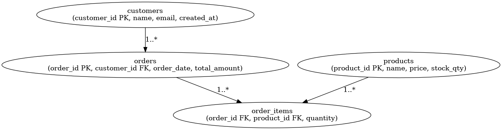

# Database Schema

The sample database models a simple **E-commerce Store**.

## Tables

### `customers`
| Column       | Type        | Description              |
|--------------|------------|--------------------------|
| customer_id  | INT (PK)   | Unique ID for customer   |
| name         | VARCHAR    | Full name                |
| email        | VARCHAR    | Email address            |
| created_at   | DATETIME   | Date of registration     |

### `products`
| Column       | Type        | Description              |
|--------------|------------|--------------------------|
| product_id   | INT (PK)   | Unique ID for product    |
| name         | VARCHAR    | Product name             |
| price        | DECIMAL    | Price in INR             |
| stock_qty    | INT        | Stock available          |

### `orders`
| Column       | Type        | Description              |
|--------------|------------|--------------------------|
| order_id     | INT (PK)   | Unique order ID          |
| customer_id  | INT (FK)   | Customer placing order   |
| order_date   | DATETIME   | Date of order            |
| total_amount | DECIMAL    | Total order value        |

### `order_items`
| Column       | Type        | Description              |
|--------------|------------|--------------------------|
| order_id     | INT (FK)   | Order reference          |
| product_id   | INT (FK)   | Product in the order     |
| quantity     | INT        | Quantity ordered         |

---

## ER Diagram

