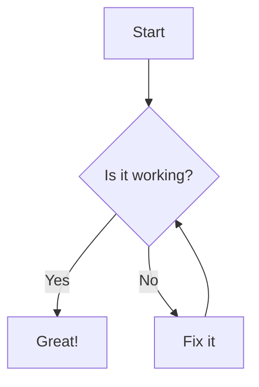
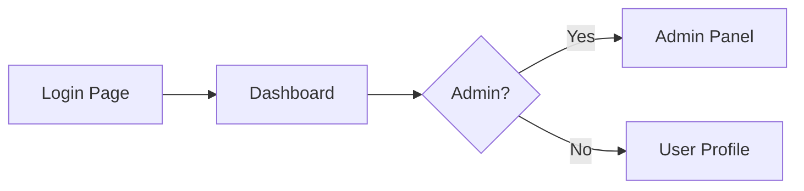
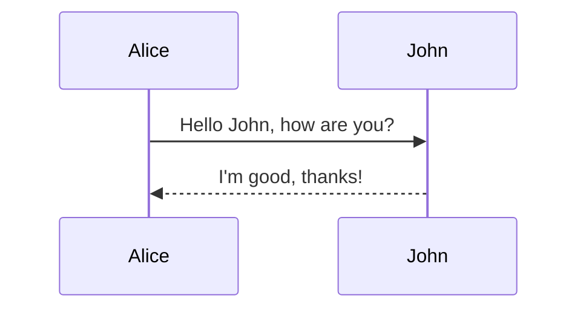
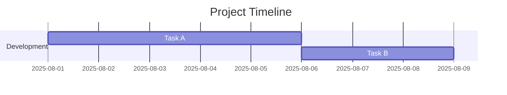
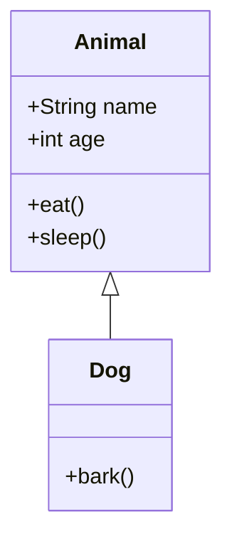

# Creating Diagrams Using Mermaid for Beginners

Mermaid is a simple markdown-like script language for generating diagrams and flowcharts. It’s widely used in documentation, especially on GitHub, GitLab, and various wikis.

---

## **1. What is Mermaid?**
Mermaid allows you to write diagrams as text, which are then rendered into visual charts.  
Advantages:
- Easy to learn
- Version control friendly (text format)
- Works directly in many documentation platforms

Official site: [https://mermaid.js.org](https://mermaid.js.org)

---

## **2. How to Use Mermaid in Markdown**
You can embed Mermaid diagrams inside Markdown using triple backticks and `mermaid` as the language:

When rendered, this produces a flowchart.

---

## **3. Common Diagram Types**
Mermaid supports multiple diagram types:

### **Flowchart**

### **Sequence Diagram**

### **Gantt Chart**

### **Class Diagram**

---

## **4. Rendering Mermaid Diagrams**
- **GitHub**: Just paste Mermaid code blocks into `.md` files (GitHub now supports Mermaid natively).
- **VS Code**: Install the "Markdown Preview Mermaid Support" extension.
- **Web**: Use the [Mermaid Live Editor](https://mermaid.live) to create and preview diagrams.

---

## **5. Tips for Beginners**
- Always start small—test a basic diagram before making it complex.
- Use descriptive labels for clarity.
- Break large diagrams into smaller ones for better readability.

---

✅ **You are now ready to create your own diagrams using Mermaid!**
